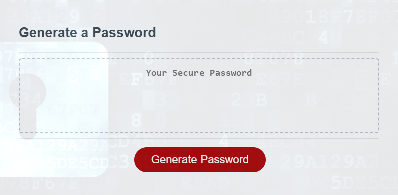
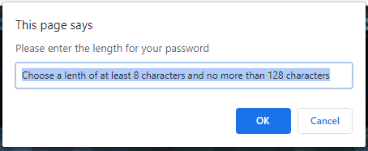
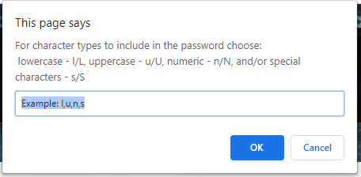
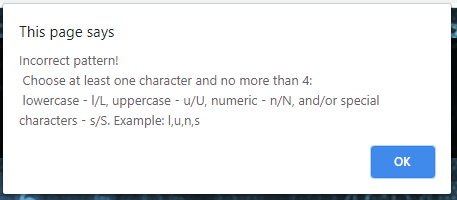
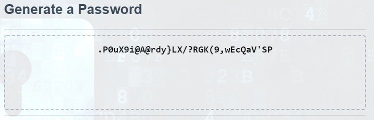

# Password Generator 


Link : [Project Link](https://cesaraugustomartinez.github.io/Homework_3/)

---

### Table of Contents

- [Description](#description)
- [How to Use](#how-to-use)
- [Screenshots](#screenshots)
- [References](#references)
- [License](#license)
- [Author Info](#author-info)

---

## Description

The goal of this project is generate a security password based on user-selected criteria. The use of Javascript code will permit to create variables, arrays, functions and conditions for generate a strong password that provides greater security. 

##### Technologies

- Html
- Javascript
- Visual Studio Code
- CSS
- Bootstrap

##### Code sample - Javascript
#
```js
function lengthValidation () { // To validate the length of the password
  var lengthPassword = prompt("Please enter the length for your password", "Choose a lenth of at least 8 characters and no more than 128 characters"); 
  var intLengthPassword = parseInt(lengthPassword);
  if ( lengthPassword === null) {
    return true;
  }
  if (isNaN(intLengthPassword) || intLengthPassword < 8 || intLengthPassword > 128 ){
    return false;
  }
  else {
    return intLengthPassword;
  }
}

function charactersValidation () { // To validate character types
  var characterTypes = prompt("For character types to include in the password choose: \n lowercase - l/L, uppercase - u/U, numeric - n/N, and/or special characters - s/S", "Example: l,u,n,s");
  var pattern = /^[lLuUnNsS,]+$/;
  if ( characterTypes === null ) {
    return true;
  }  
  if (pattern.test(characterTypes) === false || characterTypes.length > 7){
    alert("Incorrect pattern! \n Choose at least one character and no more than 4: \n lowercase - l/L, uppercase - u/U, numeric - n/N, and/or special characters - s/S. Example: l,u,n,s");
    return false;
  }
  else {
    var lowerCaseCharacters = characterTypes.toLocaleLowerCase();
    var finalCharacters = getCharacterType(lowerCaseCharacters.split(""));
    return finalCharacters;
  }

```

---

## How To Use

This web application has one webpage. It has a button to generate a security password. When the user click the button. It will present a series of prompts for password criteria. The user could select which criteria to include in the password. These criterias are: 

- Length of at least 8 characters and no more than 128 characters.

- Choose lowercase, uppercase, numeric, and/or special characters.

 Also you can access to this App through mobile, desktop and tablet devices, having a responsive website. 

## Screenshots

- Button to Generate Password



- First Criteria 



- Second Criteria 



- Alert



- Generated Password




[Back To The Top](#Password-Generator)

---

## References

- w3school -- [JavaScript Tutorial](https://www.w3schools.com/js/default.asp)
- Bootstrap -- [Grid system](https://getbootstrap.com/docs/4.5/layout/grid/)

[Back To The Top](#Password-Generator)

---

## License

Copyright (c) [2020] [Cesar A Martinez]

[Back To The Top](#Password-Generator)

---

## Author Info

- Twitter -- [@cesaguma](https://twitter.com/cesaguma)
- Linkedin -- [Cesar A Martinez](https://www.linkedin.com/in/cesar-augusto-martinez-auquilla-03934a16b/)

[Back To The Top](#Password-Generator)
